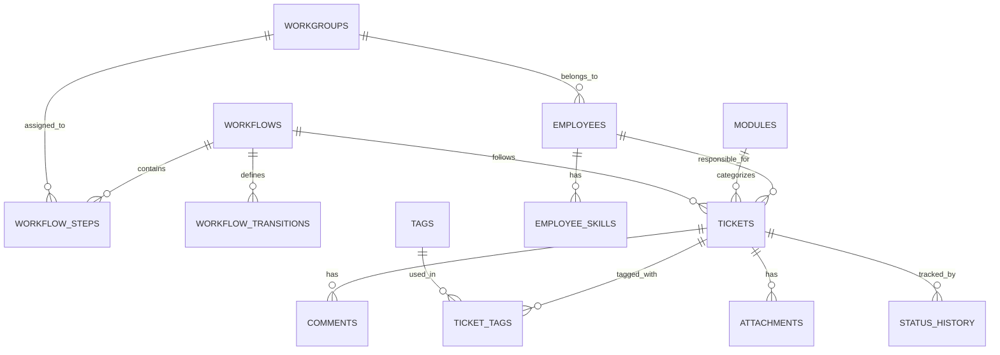

# LiteBoard - Enterprise Ticket & Workflow Management System

> A full-stack ticket management platform with customizable workflows, role-based access control, and real-time analytics dashboard.


---

## Table of Contents

1. [Project Overview](#1-project-overview)
2. [Technology Stack](#2-technology-stack)
3. [Backend Architecture](#3-backend-architecture)
4. [Frontend Architecture](#4-frontend-architecture)
5. [Code Walkthrough](#5-code-walkthrough-by-modulefile)
6. [Environment Variables & Credentials](#6-environment-variables--credentials)
7. [Setup & Run Instructions](#7-setup--run-instructions)
8. [Security & Performance Notes](#8-security--performance-notes)
9. [Improvement Recommendations](#9-improvement-recommendations)

---

## 1. Project Overview

**LiteBoard** is an enterprise-grade ticket and workflow management system designed for organizations requiring:

- **Customizable Workflows**: Define multi-step approval processes with configurable state transitions
- **Role-Based Access Control (RBAC)**: Three-tier permission system (Admin, Editor, Viewer)
- **Workgroup Isolation**: Users can only access tickets within their assigned workgroup
- **Real-Time Analytics**: Interactive dashboards with charts for ticket prioritization and status tracking
- **Dark/Light Theme Support**: System-wide theming with persistence

### Core Features

| Feature | Description |
|---------|-------------|
| **Ticket Management** | Full CRUD operations with tags, attachments, comments, and audit trail |
| **Workflow Engine** | State machine implementation with valid transition enforcement |
| **Dashboard Analytics** | 6 chart types (pie, bar, line, stacked) powered by Recharts |
| **Employee Management** | User provisioning with workgroup assignment and password hashing |
| **Module Organization** | Tickets categorized by organizational modules |
| **Status History** | Complete audit log of all ticket field changes |

### User Roles

| Role ID | Role Name | Permissions |
|---------|-----------|-------------|
| 1 | Admin | Full access: CRUD all entities, manage workflows, access admin panel |
| 2 | Editor | Create/Edit tickets within their workgroup |
| 3 | Viewer | Read-only access to tickets within their workgroup |

---

## 2. Technology Stack

### Frontend

| Technology | Version | Purpose |
|------------|---------|---------|
| **React** | 19.1.0 | UI framework with hooks and functional components |
| **React Router DOM** | 7.8.1 | Client-side routing with protected routes |
| **Recharts** | 2.15.3 | Data visualization (6 dashboard chart components) |
| **ReactFlow** | 11.11.4 | Workflow visualization (node-based diagrams) |
| **Tailwind CSS** | 3.4.17 | Utility-first CSS framework with dark mode |
| **Lucide React** | 0.518.0 | Icon library |
| **date-fns** | 4.1.0 | Date manipulation and formatting |
| **react-toastify** | 11.0.5 | Toast notifications |

### Backend

| Technology | Version | Purpose |
|------------|---------|---------|
| **Express.js** | 5.1.0 | REST API framework |
| **better-sqlite3** | 12.4.1 | Synchronous SQLite database driver |
| **bcryptjs** | 3.0.2 | Password hashing (cost factor 10) |
| **jsonwebtoken** | 9.0.2 | JWT authentication with configurable expiry |
| **cors** | 2.8.5 | Cross-origin resource sharing |
| **dotenv** | 17.2.3 | Environment variable management |

### Database

- **SQLite** via `better-sqlite3` (synchronous, file-based)
- Location: `server/db/liteboard.db`
- Schema: `server/db/schema.sql`

---

## 3. Backend Architecture

### Directory Structure

```
server/
├── server.js              # Express app bootstrap & route registration
├── .env                   # Environment variables (JWT_SECRET)
├── db/
│   ├── db.js              # SQLite connection singleton
│   ├── schema.sql         # Complete database schema
│   └── liteboard.db       # SQLite database file
├── middleware/
│   ├── authMiddleware.js  # JWT verification + role enforcement
│   └── ensureSameWorkgroup.js  # Workgroup-based access control
└── routes/
    ├── auth.js            # Login endpoint
    ├── tickets.js         # Ticket CRUD + workflow transitions
    ├── employees.js       # Employee management + password handling
    ├── workflows.js       # Read-only workflow queries
    ├── workflowManagement.js  # Admin workflow CRUD
    ├── workflowSteps.js   # Workflow step queries
    ├── workflow_transitions.js # Transition rules
    ├── modules.js         # Module management
    ├── tags.js            # Tag management
    ├── tickets_tags.js    # Ticket-tag associations
    ├── comments.js        # Ticket comments
    ├── attachments.js     # File attachments
    ├── status_history.js  # Audit trail
    ├── workgroups.js      # Workgroup management
    └── profile/
        ├── stats.js       # User statistics
        ├── activity.js    # Activity feed
        ├── myTickets.js   # User's tickets
        └── myPassword.js  # Password change
```

### Database Schema (13 Tables)



**Key Tables:**

| Table | Purpose | Key Columns |
|-------|---------|-------------|
| `employees` | User accounts | `id`, `email`, `password_hash`, `role_id`, `workgroup_code` |
| `tickets` | Main ticket entity | `id`, `title`, `status`, `priority`, `workflow_id`, `step_code`, `workgroup_id` |
| `workflows` | Workflow definitions | `id`, `name`, `active` |
| `workflow_steps` | Steps in workflow | `step_code`, `step_name`, `step_order`, `category_code` |
| `workflow_transitions` | Valid state transitions | `from_step_code`, `to_step_code`, `cancel_allowed` |
| `status_history` | Audit trail | `activity_type`, `field_name`, `old_value`, `new_value`, `changed_by` |
| `roles` | User roles (implied by schema) | Referenced by `role_id` in employees |

### API Route Summary

| Route | Methods | Auth | Description |
|-------|---------|------|-------------|
| `/api/auth/login` | POST | None | User authentication, returns JWT |
| `/api/tickets` | GET, POST | Token + Role | List/create tickets |
| `/api/tickets/:id` | GET, PUT, DELETE | Token + Role + Workgroup | Single ticket operations |
| `/api/tickets/:id/transition` | POST | Token + Admin/Editor | Workflow state change |
| `/api/tickets/:id/allowed-steps` | GET | Token | Get valid next steps |
| `/api/employees` | GET, POST | Token | Employee list/create |
| `/api/employees/:id` | GET, PUT | Token | Single employee operations |
| `/api/workflows` | GET | None | List active workflows |
| `/api/workflow_management` | GET, POST, PATCH, DELETE | Token | Admin workflow CRUD |
| `/api/modules` | GET, POST, PUT, DELETE | Token | Module management |
| `/api/tags` | GET, POST, PUT, DELETE | Token | Tag management |
| `/api/comments` | GET, POST, PUT, DELETE | Token | Ticket comments |
| `/api/attachments` | GET, POST, DELETE | Token | File attachments |
| `/api/workgroups` | GET | None | Workgroup list |
| `/api/profile/*` | GET, PUT | Token | User profile operations |

### Authentication Flow

```
┌─────────────┐      POST /api/auth/login      ┌─────────────┐
│   Client    │ ────────────────────────────► │   Server    │
│             │   {email, password}            │             │
└─────────────┘                                └─────────────┘
                                                      │
                                              bcrypt.compareSync()
                                                      │
                                               ┌──────▼──────┐
                                               │  JWT Sign   │
                                               │  (8h exp)   │
                                               └──────┬──────┘
                                                      │
┌─────────────┐       {token, user}            ┌──────▼──────┐
│   Client    │ ◄───────────────────────────── │   Server    │
│ localStorage│                                │             │
└─────────────┘                                └─────────────┘
       │
       │ All subsequent requests:
       │ Authorization: Bearer <token>
       ▼
┌─────────────────────────────────────────────────────────────┐
│  authMiddleware.js: jwt.verify() + optional role check      │
└─────────────────────────────────────────────────────────────┘
```

### Middleware Pipeline

1. **`authenticateToken(requiredRoles[])`**
   - Extracts Bearer token from `Authorization` header
   - Verifies JWT signature using `JWT_SECRET`
   - Attaches decoded user to `req.user`
   - Optionally enforces role requirements

2. **`ensureSameWorkgroup`**
   - Runs after authentication
   - Admins (role_id=1) bypass check
   - Compares employee's `workgroup_code` with ticket's `workgroup_id`
   - Blocks cross-workgroup access for non-admins

---

## 4. Frontend Architecture

### Directory Structure

```
client/src/
├── App.js                 # Root component with routing
├── index.js               # React entry point
├── index.css              # Global styles + Tailwind directives
├── useFetch.js            # Custom hook for authenticated API calls
├── contexts/
│   └── ThemeContext.js    # Dark/light theme provider
├── components/
│   ├── Navigation.js      # Header navigation with role-based menu
│   ├── Badge.js           # Status/priority badges
│   ├── Button.js          # Reusable button component
│   ├── Card.js            # Card container
│   ├── ViewTicket.js      # Ticket detail view (25KB)
│   ├── hooks/             # Custom hooks
│   ├── Auth/
│   │   └── ProtectedRoute.js  # Route guard with role checking
│   ├── Dashboard/         # 7 dashboard chart components
│   ├── Profile/           # 4 profile components
│   ├── AdminPanel/        # 9 admin components
│   ├── TicketManagement/  # 5 ticket form components
│   └── TicketsPage/       # 4 ticket list components
├── pages/
│   ├── LoginPage.jsx      # Authentication page
│   ├── Dashboard.js       # Analytics dashboard
│   ├── TicketsPage.js     # Ticket list with filters
│   ├── CreateTicketPage.js # Ticket creation form
│   ├── ProfileActivity.jsx # User profile
│   └── AdminPanel.js      # Admin settings
└── constants/
    └── ...                # Application constants
```

### Routing Configuration

```javascript
// Role-based route protection
<Route path="/create-ticket"
  element={<ProtectedRoute requiredRole={[1, 2]}><CreateTicketPage /></ProtectedRoute>}
/>
<Route path="/admin"
  element={<ProtectedRoute requiredRole={1}><Admin /></ProtectedRoute>}
/>
```

| Route | Component | Required Role |
|-------|-----------|---------------|
| `/login` | LoginPage | None |
| `/` or `/dashboard` | Dashboard | Any authenticated |
| `/tickets` | TicketsPage | Any authenticated |
| `/create-ticket` | CreateTicketPage | Admin (1) or Editor (2) |
| `/view-ticket/:id` | ViewTicket | Any authenticated |
| `/edit-ticket/:id` | EditTicket | Any authenticated |
| `/profile` | ProfileActivity | Any authenticated |
| `/admin` | AdminPanel | Admin (1) only |

### State Management Pattern

The application uses a **hooks-based architecture** without external state management:

1. **Authentication State**: `localStorage` for token + user object
2. **Theme State**: React Context (`ThemeContext`)
3. **Data Fetching**: Custom `useFetch` hook with JWT injection
4. **Form State**: Local `useState` per component

### Custom Hooks

#### `useFetch(url)` - Authenticated Data Fetcher

```javascript
// Automatically injects JWT from localStorage
// Returns: { data, isPending, error }
const { data, isPending, error } = useFetch("http://localhost:8000/api/tickets");
```

**Key Features:**
- Automatically includes `Authorization: Bearer <token>` header
- Blocks requests to `/api/*` routes without token
- Handles 401/403 responses with descriptive errors
- Supports AbortController for cleanup

#### `useTheme()` - Theme Context Consumer

```javascript
const { theme, toggleTheme } = useTheme();
// theme: "light" | "dark"
// toggleTheme: () => void
```

---

## 5. Code Walkthrough (by module/file)

### Backend Modules

#### `server/server.js` - Application Bootstrap

**Purpose**: Express application initialization and route registration

**Key Operations:**
1. Loads environment variables via `dotenv`
2. Initializes Express with CORS and JSON parsing
3. Registers 17 route modules under `/api/*` prefix
4. Starts HTTP server on port 8000

```javascript
app.use(cors());
app.use(express.json());
app.use("/api/tickets", ticketsRouter);
// ... 16 more routes
app.listen(8000, () => console.log("Server running"));
```

---

#### `server/middleware/authMiddleware.js` - JWT Authentication

**Purpose**: Verify JWT tokens and enforce role-based access

**Function: `authenticateToken(requiredRoles = [])`**

| Parameter | Type | Description |
|-----------|------|-------------|
| `requiredRoles` | `number[]` | Array of allowed role IDs (empty = any authenticated user) |

**Logic Flow:**
1. Extract token from `Authorization: Bearer <token>` header
2. Return 401 if missing
3. Verify token signature with `process.env.JWT_SECRET`
4. Attach decoded payload to `req.user`
5. Check role if `requiredRoles` specified
6. Return 403 if role not in allowed list

---

#### `server/middleware/ensureSameWorkgroup.js` - Workgroup Authorization

**Purpose**: Prevent users from accessing tickets outside their workgroup

**Logic Flow:**
1. Skip check for Admins (role_id = 1)
2. Query employee's `workgroup_code`
3. Query ticket's `workgroup_id`
4. Compare values; return 403 on mismatch

---

#### `server/routes/tickets.js` - Ticket API (439 lines)

**Purpose**: Complete ticket lifecycle management

**Key Functions:**

| Function | Endpoint | Description |
|----------|----------|-------------|
| `isValidTransition()` | Helper | Validates workflow state changes |
| `getAllowedNextSteps()` | Helper | Returns valid next steps for a ticket |
| GET `/` | Route | List all tickets with tags, modules, workgroups |
| GET `/:id` | Route | Single ticket with comments, attachments |
| POST `/` | Route | Create ticket (Admin/Editor, with transaction) |
| PUT `/:id` | Route | Update ticket (Admin/Editor + same workgroup) |
| DELETE `/:id` | Route | Delete ticket (Admin only, cascading delete) |
| POST `/:id/transition` | Route | Workflow state change with validation |
| GET `/:id/allowed-steps` | Route | Get valid next workflow steps |

**Workflow Transition Logic:**
```javascript
const isValidTransition = (workflowId, fromStepCode, toStepCode) => {
  const transition = db.prepare(`
    SELECT id FROM workflow_transitions
    WHERE workflow_id = ? AND from_step_code = ? AND to_step_code = ?
  `).get(workflowId, fromStepCode, toStepCode);
  return !!transition;
};
```

---

#### `server/routes/workflowManagement.js` - Admin Workflow CRUD (319 lines)

**Purpose**: Create, update, and manage workflow definitions

**Key Features:**
- Auto-generates workflow IDs (`WF-001`, `WF-002`, ...)
- Auto-generates step codes (`WF-001-01`, `WF-001-02`, ...)
- Manages workflow transitions (bidirectional)
- Special handling for Cancel steps (`category_code = 90`)
- Soft delete via `active = 0`

**Step Category Codes:**
| Code | Meaning |
|------|---------|
| 10 | Standard step |
| 90 | Cancel step (all-to-one transition) |

---

#### `server/routes/employees.js` - Employee Management (245 lines)

**Purpose**: User account management with password handling

**Key Features:**
- Auto-generates employee IDs (`EMP-001`, `EMP-002`, ...)
- bcrypt password hashing with salt rounds = 10
- Role and workgroup assignment
- Duplicate email prevention

---

### Frontend Modules

#### `client/src/App.js` - Application Root

**Purpose**: Configure routing and global providers

**Structure:**
```jsx
<ThemeProvider>
  <Router>
    <AppLayout>
      <Navigation /> {/* Hidden on /login */}
      <Routes>
        {/* 9 routes with ProtectedRoute wrappers */}
      </Routes>
      <ToastContainer />
    </AppLayout>
  </Router>
</ThemeProvider>
```

---

#### `client/src/contexts/ThemeContext.js` - Theme Management

**Purpose**: Application-wide dark/light mode with persistence

**Features:**
- Persists preference to `localStorage`
- Respects `prefers-color-scheme` on first load
- Toggles `dark` class on `document.documentElement`

---

#### `client/src/components/Navigation.js` - Header Navigation

**Purpose**: Role-aware navigation with logout

**Role-Based Menu:**
- All users: Dashboard, Tickets, Profile
- Admin/Editor: + Create Ticket
- Admin only: + Admin Panel

---

#### `client/src/components/Auth/ProtectedRoute.js` - Route Guard

**Purpose**: Redirect unauthenticated users and enforce role requirements

```jsx
<ProtectedRoute requiredRole={[1, 2]}>
  <CreateTicketPage />
</ProtectedRoute>
```

---

#### `client/src/pages/Dashboard.js` - Analytics Dashboard

**Purpose**: Interactive ticket analytics with filtering

**Components Used:**
- `FilterBar` - Workgroup/Module/Status filters
- `TotalPendingTickets` - Summary card
- `OpenTicketsPieChart` - Pie chart by workgroup
- `TicketPriorityChart` - Bar chart by priority
- `TicketStatusChart` - Bar chart by status
- `TicketModuleStackedChart` - Stacked bar by module
- `TicketsCreatedLineChart` - Time series line chart

---

#### `client/src/components/ViewTicket.js` - Ticket Detail View (25KB)

**Purpose**: Complete ticket view with actions

**Features:**
- Ticket metadata display
- Workflow step navigation with allowed transitions
- Comments section (add/edit/delete)
- Attachments list with download
- Status history (audit trail)
- Edit/Delete actions for authorized users

---

## 6. Environment Variables & Credentials

### Server Environment (`.env`)

| Variable | Required | Description | Example |
|----------|----------|-------------|---------|
| `JWT_SECRET` | Yes | Secret key for JWT signing | `your-256-bit-secret` |
| `JWT_EXPIRES_IN` | No | Token expiration time | `8h` (default) |

### Client Environment

| Variable | Description |
|----------|-------------|
| N/A | No environment variables; API URL hardcoded to `http://localhost:8000` |

### Storage Locations

| Data | Location |
|------|----------|
| JWT Token | `localStorage.token` |
| User Object | `localStorage.user` (JSON stringified) |
| Theme Preference | `localStorage.theme` |

---

## 7. Setup & Run Instructions

### Prerequisites

- Node.js v18 or higher
- npm v9 or higher

### Installation

```bash
# Clone the repository
git clone <repository-url>
cd liteboard

# Install root dependencies (shared packages)
npm install

# Install server dependencies
cd server
npm install  # If separate package.json exists

# Install client dependencies
cd ../client
npm install
```

### Environment Setup

```bash
# Create server/.env file
cd server
echo "JWT_SECRET=your-super-secret-key-change-in-production" > .env
echo "JWT_EXPIRES_IN=8h" >> .env
```

### Database Initialization

The SQLite database (`server/db/liteboard.db`) should already exist with schema applied. To reinitialize:

```bash
cd server/db
sqlite3 liteboard.db < schema.sql
```

### Running the Application

**Terminal 1 - Backend:**
```bash
cd server
node server.js
# Output: ✅ Server running on http://localhost:8000
```

**Terminal 2 - Frontend:**
```bash
cd client
npm start
# Opens http://localhost:3000 in browser
```

### Default Access

Since there's no registration endpoint, ensure at least one admin user exists in the database with a bcrypt-hashed password.

---

## 8. Security & Performance Notes

### Security Considerations

| Area | Implementation | Status |
|------|----------------|--------|
| **Password Storage** | bcrypt with salt rounds = 10 | ✅ Good |
| **Authentication** | JWT with configurable expiration | ✅ Good |
| **Authorization** | Role + Workgroup middleware | ✅ Good |
| **SQL Injection** | Parameterized queries via better-sqlite3 | ✅ Good |
| **CORS** | Enabled but unrestricted | ⚠️ Needs configuration |
| **Rate Limiting** | Not implemented | ❌ Missing |
| **Input Validation** | Minimal server-side validation | ⚠️ Needs improvement |
| **Error Exposure** | Detailed errors in console | ⚠️ Review for production |

### Performance Characteristics

| Aspect | Details |
|--------|---------|
| **Database** | SQLite (synchronous) - suitable for up to ~1M records |
| **Indexes** | Comprehensive indexes on all foreign keys and search columns |
| **Triggers** | Automatic `updated_at` timestamp updates |
| **Query Pattern** | Prepared statements with caching |
| **Frontend** | No SSR; React SPA with client-side rendering |

### Scalability Limitations

1. **SQLite**: Single-writer lock; not suitable for high-concurrency write loads
2. **File Storage**: Attachments stored as BLOBs in database (memory-intensive for large files)
3. **Session State**: Stateless JWT (no server-side session invalidation)
4. **API URL**: Hardcoded `localhost:8000` requires configuration for deployment

---

## 9. Improvement Recommendations

### High Priority

| Issue | Recommendation |
|-------|----------------|
| **No HTTPS enforcement** | Add SSL/TLS termination; enforce secure cookies |
| **Missing rate limiting** | Add `express-rate-limit` middleware |
| **No input validation** | Implement schema validation (Joi, Zod, or express-validator) |
| **Hardcoded API URL** | Move to environment variable (`REACT_APP_API_URL`) |
| **No password reset** | Implement email-based password recovery |
| **CORS unrestricted** | Configure allowed origins for production |

### Medium Priority

| Issue | Recommendation |
|-------|----------------|
| **No pagination** | Add offset/limit for ticket list endpoint |
| **Missing search** | Add full-text search on ticket title/description |
| **No caching** | Add Redis for frequently accessed data (workflows, tags) |
| **File attachments in DB** | Move to file system or object storage (S3) |
| **No logging** | Add Winston or Pino for structured logging |
| **No request IDs** | Add correlation IDs for distributed tracing |

### Low Priority / Technical Debt

| Issue | Recommendation |
|-------|----------------|
| **Magic numbers** | Extract category codes (10, 90) to constants |
| **Timezone handling** | Use consistent UTC storage; format in frontend |
| **Test coverage** | Add Jest unit tests and Supertest API tests |
| **TypeScript adoption** | Gradual migration for type safety |
| **API documentation** | Add OpenAPI/Swagger specification |
| **Error boundaries** | Add React error boundaries for graceful failures |

### Architecture Improvements

1. **Migrate to PostgreSQL** for better concurrency and JSON support
2. **Add WebSocket** for real-time ticket updates
3. **Implement optimistic UI** updates with rollback
4. **Add audit log viewer** in admin panel
5. **Enable workflow visualization** in admin panel using ReactFlow

---

## License

This project is proprietary. All rights reserved.

---

*Documentation generated by Principal Software Architect review, 2025.*
